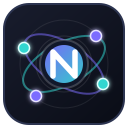

<p align="center">
  
</p>

<h1 align="center">Nucleus</h1>

<p align="center">
  A production-oriented Godot project foundation: stable core, composable
  systems, and game-specific policy left to the game.
</p>

<p align="center">
  <a href="https://github.com/sempitern0/Nucleus/actions/workflows/nucleus-ci.yml">
    
  </a>
  
  
  
  <a href="LICENSE">
    
  </a>
</p>

Nucleus is a reusable Godot project foundation for starting games with tested
application infrastructure, semantic input, settings, save, audio, scene flow,
gameplay composition, UI/accessibility, optional production modules, and CI.

It is a **project template**, not an addon framework and not a catalogue of every
game mechanic. Godot remains the engine and source of truth; Nucleus adds policy
only where a reusable ownership boundary has proved useful.

## Project status

| Contract | Current status |
| --- | --- |
| Template version | See [`VERSION`](VERSION) |
| Godot | `4.7.2-stable` is the release-gated reference |
| API | Pre-1.0; usable, but public contracts may still evolve |
| CI | Static checks, docs, Godot tests, smoke scene, Linux/Windows/Web exports |
| License | [MIT](LICENSE) |
| Main CI | [Nucleus CI workflow](https://github.com/sempitern0/Nucleus/actions/workflows/nucleus-ci.yml) |

The default project intentionally has **no main game scene**. A consuming game
owns its entry point, art direction, rules, balance, product defaults, and
platform/store policy.

## Philosophy

- **Godot-native first.** Wrap an engine API only when Nucleus genuinely owns a
  reusable policy around it.
- **Composition over inheritance.** Game-facing behavior is built from small
  nodes/resources around normal Godot scenes.
- **Scene ownership first.** Autoloads are kept deliberately small.
- **Semantic input.** Gameplay asks for actions, not physical keys, controller
  indices, or touch coordinates.
- **Secure by default at trust boundaries.** Untrusted content is treated as
  data, not executable Godot resources.
- **Production evidence drives reuse.** Real friction in consuming games earns a
  place in the template; speculative abstractions do not.
- **Optional systems stay optional.** Games compose only the modules they need.
- **Game policy stays in the game.** Nucleus should make common work reliable
  without deciding how every game must feel or play.

The root [`AGENTS.md`](AGENTS.md) is the compact implementation contract for
human and AI contributors.

## Baseline Autoloads

The global surface remains deliberately small:

```text
NucleusApp
NucleusSettings
NucleusInput
NucleusAudio
NucleusSave
NucleusSceneFlow
```

Optional modules are not silently promoted to Autoloads.

## What is included

| Area | Typical responsibilities | Start here |
| --- | --- | --- |
| Core runtime | lifecycle, logging, paths, windows, utilities | [`core_runtime.md`](docs/components/core_runtime.md) |
| Settings + input | settings, rebinding, gamepads, touch/local input | [`settings_and_input.md`](docs/components/settings_and_input.md) |
| Runtime services | audio, save, scene flow, localization | [`audio_save_scene_localization.md`](docs/components/audio_save_scene_localization.md) |
| Gameplay foundation | health/value pools, damage, interaction, timers, state | [`gameplay_foundation.md`](docs/components/gameplay_foundation.md) |
| Actions + stats | actions, attributes, modifiers, status effects | [`gameplay_actions_attributes_status.md`](docs/components/gameplay_actions_attributes_status.md) |
| Movement + camera | 2D/3D motion input, motors, camera rigs | [`gameplay_movement_camera.md`](docs/components/gameplay_movement_camera.md) |
| Pooling + targeting | pools, spawners, sensing, targeting | [`gameplay_pooling_targeting.md`](docs/components/gameplay_pooling_targeting.md) |
| World presentation | adaptive decals and reusable world feedback | [`world_decals.md`](docs/components/world_decals.md) |
| UI + accessibility | focus, motion, toast/modal/tooltip, responsive layout | [`ui_and_accessibility.md`](docs/components/ui_and_accessibility.md) |
| Animation | AnimationTree-facing integration | [`animation_integration.md`](docs/components/animation_integration.md) |
| Camera/game feel | shake, impulses, feedback and motion policy | [`camera_game_feel.md`](docs/components/camera_game_feel.md) |

Optional modules cover:

```text
Performance / Diagnostics
EventBus
Networking + online replication
Inventory / Equipment
Probability / Loot
Persistent World State
AI / Navigation
Platform Services
Content Packs / DLC / data-only community mods
Mobile Foundation
```

Performance / Diagnostics adds opt-in sampling of Godot's native performance
monitors, game-owned budgets, trace markers, reports, and a compact development
panel while keeping the Profiler, Network Profiler, and Video RAM tools native.
See [`performance.md`](docs/modules/performance.md).

Content Packs deliberately distinguishes **signed trusted PCKs** from
**untrusted data mods**. Community content is never mounted through Godot's
resource-pack loader by the Nucleus data-mod API. See
[`content_packs.md`](docs/modules/content_packs.md).

Mobile Foundation adds first-class touch seats, virtual controls, touch-look,
handheld haptics, orientation and permission helpers while reusing the same
semantic actions as desktop/gamepad gameplay. See
[`mobile.md`](docs/modules/mobile.md).

## Learn Nucleus by building

The documentation is designed to work as a learning path, not only as API
reference.

Start at [`docs/guides/tutorials/README.md`](docs/guides/tutorials/README.md) or
choose a focused quickstart:

- [Settings and input](docs/guides/settings_input_quickstart.md)
- [Performance and diagnostics](docs/guides/performance_quickstart.md)
- [Local multiplayer/device ownership](docs/guides/local_multiplayer_quickstart.md)
- [Audio](docs/guides/audio_quickstart.md)
- [Save](docs/guides/save_quickstart.md)
- [Scene flow](docs/guides/scene_flow_quickstart.md)
- [Localization](docs/guides/localization_quickstart.md)
- [Networking](docs/guides/networking_quickstart.md)
- [Content Packs / DLC / mods](docs/guides/content_packs_quickstart.md)
- [Mobile](docs/guides/mobile_quickstart.md)
- [Real-game patterns](docs/guides/real_game_patterns.md)

The intended learning hierarchy is:

```text
Quickstart
    learn ownership and first setup
        ↓
Tutorial
    build one concrete feature end-to-end
        ↓
Technical contract
    inspect lifetime, public API, limits, and extension points
```

## Input that stays out of the player's way

Nucleus uses Godot's `Input` and `InputMap`; it does not replace them.

The baseline supports:

- keyboard/mouse, gamepad, and touch source detection;
- automatic single-player keyboard/gamepad/touch hot-swap;
- stable local-player seats for couch multiplayer;
- device-aware prompts and controller-family labels;
- runtime rebinding persisted through Settings;
- scene-owned controller connection/disconnection toasts;
- virtual touch sticks/action buttons that feed the same gameplay actions;
- touch-look that feeds the same `NucleusMotionInput` used by camera rigs;
- shared vibration policy across gamepad rumble and handheld haptics.

A key boundary is intentional:

```text
ui_accept / ui_cancel
    → active UI navigation, menus and dialogs

move_* / interact / primary_action / secondary_action / pause / game actions
    → gameplay semantics
```

A world scene should not interpret `ui_cancel` as a universal "leave game"
command. The same physical B/Circle input may be a gameplay action while an open
menu still uses it to go back.

## Secure extensible content

Nucleus supports two intentionally different content paths:

```text
Official patch / DLC / trusted pack
    detached signature
    + manifest SHA-256 binding
    + compatibility / dependency / entitlement policy
    → verified before ProjectSettings.load_resource_pack()

Community mod
    JSON manifest
    + strict path / size / extension validation
    + data-only read API
    → never mounted into res://
```

The default community-mod whitelist is deliberately text-only (`json`, `csv`,
`txt`). Games may explicitly opt into additional inert/media formats after
reviewing the parser surface. Scripts, scenes, Resources, GDExtensions, native
libraries, WebAssembly, nested archives, and executable/script formats are hard
blocked by the default data-mod policy.

Private signing keys must never be committed or shipped. Nucleus includes a
headless signing tool that accepts the private key from an external path; only
the public verification key belongs in the game.

See:

- [`docs/modules/content_packs.md`](docs/modules/content_packs.md)
- [`docs/guides/content_packs_quickstart.md`](docs/guides/content_packs_quickstart.md)
- [`docs/guides/tutorials/content_packs.md`](docs/guides/tutorials/content_packs.md)

## Mobile foundation

Nucleus treats mobile as another input/platform environment, not a separate
version of gameplay.

Existing lifecycle, settings, accessibility, safe-area, and breakpoint systems
are reused. The optional mobile layer adds only missing reusable policy:

```text
touch player seat
virtual stick / action button / touch-look
handheld haptics
orientation policy
permission helpers
native Godot sensor access
```

Android/iOS product decisions such as control placement, graphics presets,
permission rationale UX, billing, push notifications, ads, or analytics remain
project/provider concerns.

See:

- [`docs/modules/mobile.md`](docs/modules/mobile.md)
- [`docs/guides/mobile_quickstart.md`](docs/guides/mobile_quickstart.md)
- [`docs/guides/tutorials/mobile.md`](docs/guides/tutorials/mobile.md)

## Start a new game

Use a **versioned Nucleus package or pinned commit**, not an unpinned moving
branch.

1. Obtain Nucleus and create a new repository for the game.
2. Open it with the Godot version declared in
   [`docs/policies/godot_compatibility.md`](docs/policies/godot_compatibility.md).
3. Change `application/config/name` and project-specific presentation defaults.
4. Create the game's main scene and assign it in Project Settings.
5. Keep the baseline Autoloads until you intentionally replace a documented
   dependency.
6. Add optional modules only when the game needs them.
7. Run validation before game-specific work begins.

Detailed setup is in [`docs/guides/installation.md`](docs/guides/installation.md).

## Validation and CI

Fast local checks:

```bash
python3 scripts/ci/static_checks.py
python3 scripts/ci/documentation_audit.py
python3 scripts/ci/productization_audit.py
```

Authoritative Godot checks:

```bash
godot --headless --path . --import
godot --headless --path . --check-only --script res://tests/headless/test_runner.gd
godot --headless --path . --script res://tests/headless/test_runner.gd
godot --headless --path . res://tests/smoke/smoke_main.tscn
```

Editor regression tests are also available through
`tests/editor/test_runner.tscn` with **F6**.

GitHub Actions runs the product contracts and additionally smoke-exports Linux,
Windows, and Web. Mobile runtime/export validation should be performed on the
relevant Android/iOS toolchains until dedicated mobile export jobs are added.

See [`docs/guides/validation_ci_quickstart.md`](docs/guides/validation_ci_quickstart.md).

## Documentation map

Start with [`docs/README.md`](docs/README.md).

```text
docs/guides/        task-oriented quickstarts and tutorials
docs/components/    baseline ownership and technical contracts
docs/modules/       optional module contracts
docs/architecture/  dependency direction and design rationale
docs/policies/      compatibility and stability promises
docs/roadmap/       iterations, evidence and future direction
```

Important product contracts:

- [Installation](docs/guides/installation.md)
- [Versioning](docs/policies/versioning.md)
- [Godot compatibility](docs/policies/godot_compatibility.md)
- [API stability](docs/policies/api_stability.md)
- [Deprecation](docs/policies/deprecation.md)
- [Releasing and packaging](docs/guides/releasing.md)
- [Changelog](CHANGELOG.md)

## Versioning

Nucleus follows Semantic Versioning for the **template itself**. The source of
truth is [`VERSION`](VERSION), deliberately independent from the consuming
game's `application/config/version`.

Before 1.0, public APIs may evolve between Nucleus minor versions. Intentional
breaking changes still require changelog and migration documentation.

See [`docs/policies/versioning.md`](docs/policies/versioning.md).

## Open source

Nucleus is developed in the open under the [MIT License](LICENSE). Issues and
pull requests are welcome when they preserve the template's scope, trust
boundaries, and ownership rules.

Before contributing code, read [`AGENTS.md`](AGENTS.md) and the technical
contract for the subsystem you are changing.

## Barebone lineage

Nucleus is the successor to the author's earlier `Barebone` Godot template.
Reusable ideas and selected implementation work were salvaged or redesigned,
but Nucleus does **not** provide a Barebone compatibility layer.

The old DLCManager idea is represented by the modern Content Packs module, but
with explicit verification, trust separation, dependencies, compatibility, and
data-only community-mod policy rather than automatically mounting discovered
third-party PCKs.

## License

Nucleus is licensed under the [MIT License](LICENSE).

A game created from Nucleus may use another license, including a proprietary
one. When redistributing Nucleus-derived code, retain the MIT notice for the
Nucleus portions as required by the license.
